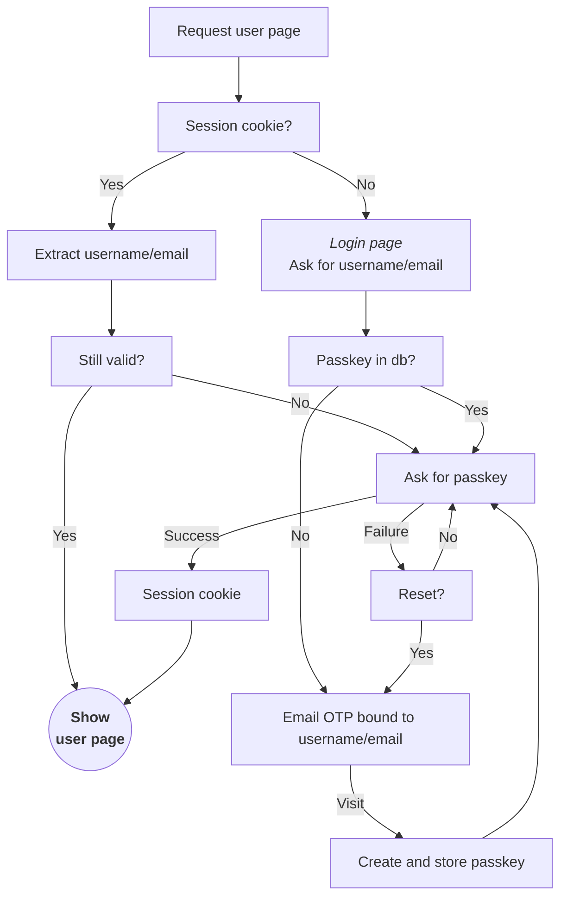

#

object storage

```
/
  sid
    {session_id} -> (user,timestamp)
    {session_id} -> (user,timestamp)
  otp
    email
      {encrypted_email_hash}
        {otp_token}
      {encrypted_email_hash}
      {encrypted_email_hash}
    sms
      {encrypted_sms_hash}
  pk
    {user}
      {passkey}
      {passkey}
    {user}
      {passkey}
```

### Sessions



Two session cookies are used, one for the server and one for javascript:

- `st`  
  contains the session expiration timestamp (millis)

- `sid`
  *http-only*<br>
  contains the session id

API requests return `403 FORBIDDEN` if `sid` is missing or expired.

For user scoped html pages, the server first checks if the `sid` exists and has user info, and if not redirects to the
login page.

The page itself should check the `st` cookie and if missing or expired, it should trigger the passkey auth.


