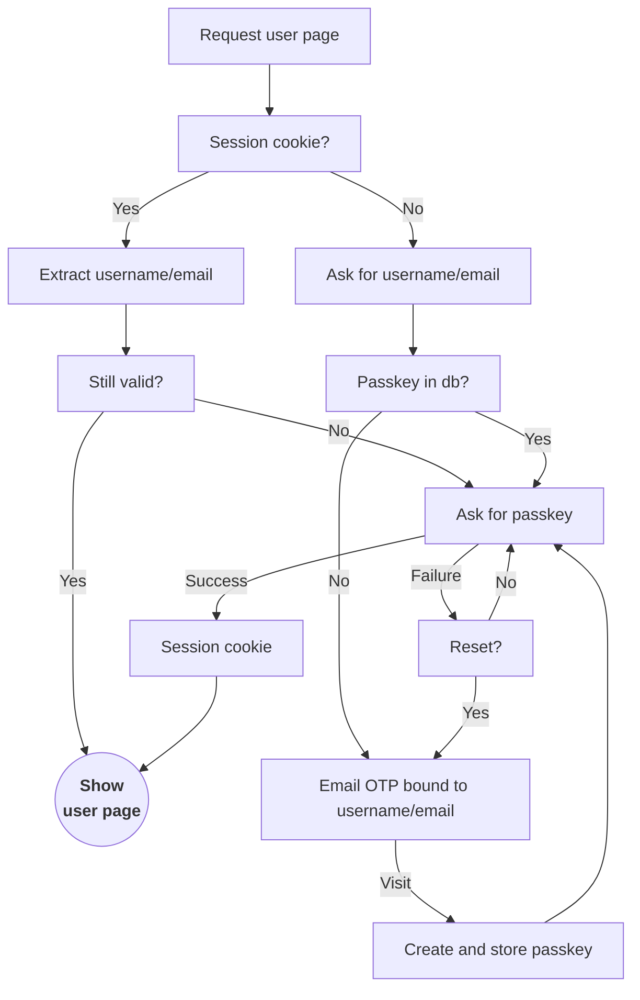

#

object storage

```
/
  otp
    email
      {encrypted_email_hash_1}
        {otp_token_1}
      {encrypted_email_hash_2}
      {encrypted_email_hash_3}
    sms
      {encrypted_sms_hash_1}
  pk
    {encrypted_email_hash_2}
      {pk_1}
```


