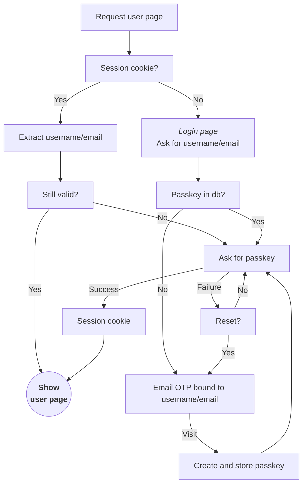

### Rust http server with static content and user protected content.

The server is set up so that it doesn't require disk access.

The static content comes from a GitHub repository.<br>
[zip_static_handler](https://crates.io/crates/zip_static_handler) is used for that purpose.<br>
The [project page](https://github.com/programingjd/zip_static_handler) details the conventions for directory indices and
redirects.
Which repository is used is configurable with the environment variables:

- `STATIC_GITHUB_USER`
- `STATIC_GITHUB_REPOSITORY`
- `STATIC_GITHUB_BRANCH`

You can also set up a webhook to notify the server when the content has changed and needs to be updated.
You can do that with a GitHub push webhook (you can use any path, the server ignores it). You need to specify the token
with the variable:

- `STATIC_GITHUB_WEBHOOK_TOKEN`

Part of the static content should include templates for the messages sent for account creation and credentials resets.
You need to specify where those templates are with the variable:

- `TEMPLATE_PATH_PREFIX` (defaults to `/templates` if not set)

<br>

The server is meant to be behind the Cloudflare CDN.<br>
You need to register the apex domain and its `www` subdomain with Cloudflare, and specify the apex domain with the
variable:

- `DOMAIN_APEX` (e.g. `example.com`)

There's a built-in firewall that terminates the connections unless they come
from either one of Cloudflare CDN servers or one of the GitHub webook servers for the update webhook.

The server is HTTPS only and the certificate is self-signed.

<br>

You need to specify a prefix for the static content that is scoped to the user and require the user to be logged in,
and you also need to specify the path for the login page.

- `USER_PATH_PREFIX` (defaults to `/user` if not set)
- `LOGIN_PATH` (defaults to `/login` if not set)

You also need to reserve a prefix for the API, and specify what it is with the variable:

- `API_PATH_PREFIX` (defaults to `/api` if not set)

<br>

The user data is stored in an S3 bucket. You need to provide the information needed to access it:

- `S3_REGION`
- `S3_ENDPOINT`
- `S3_BUCKET`
- `S3_ACCESS_KEY`
- `S3_SECRET_KEY`

That content is encrypted so that the information stays safe even if access to the bucket is obtained. You should
specify the encryption parameters with the variables:

- `STORE_ENCRYPTION_KEY` (32 bytes base64-encoded with no padding)
- `OTP_SIGNING_KEY` (32 bytes base64-encoded with no padding)
- `IDENTIFICATION_HASH_PREFIX` (e.g. `my_prefix_for_id_hashes_`)

<br>

You also need to specify what service to use to send messages to users for registering an account or resetting their
credentials with the variables:

- `EMAIL_API_ENDPOINT` (defaults to `https://smtp.maileroo.com/send`)
- `EMAIL_API_AUTH_HEADER`
- `EMAIL_API_AUTH_TOKEN`
- `EMAIL_API_METHOD` (defaults to `POST`)
- `EMAIL_API_REQUEST_CONTENT_TYPE` (defaults to `multipart/form-data`)
- `EMAIL_SEND_ADDRESS` (e.g. `noreply@example.com`)
- `EMAIL_NEW_CREDENTIALS_TITLE`
- `EMAIL_NEW_CREDENTIALS_TEMPLATE` (should be under the template prefix)

<br>

---

<br>

### S3 object storage

session ids are under `/sid`:

```
/sid/{session_id} -> (user_id,identity_hash,timestamp)
```

one-time login tokens are under `/otp`:

```
/otp/{otp_token} -> (user_id,identity_hash,timestamp)
```

passkeys are under `/pk`:

```
/pk/{identity_hash}/{user_id} -> {user}
/pk/{identity_hash}/{user_id}/{passkey} -> {}
```

registrations pending approval are under `/reg`:

```
/reg/{user_id} -> {user}
```

<br>

---

<br>

### Connection



Two cookies are used, one for the server and one for javascript:

- `st` (accessible from javascript)<br>
  contains the connection expiration timestamp

- `sid`
  *http-only (not accessible from javascript)*<br>
  contains the session id

Both cookies have the maximum lifespan (400 days) because they don't include any sensitive information.

API requests return `403 FORBIDDEN` if the session id from the `sid` cookie is missing or expired.

For user-scoped html pages, the server first checks if the `sid` cookie exists and refers to an
existing session id with user info (but it might be expired).

The page (javascript) should look for the `st` cookie.<br>
If its value indicates that the connection has expired (or the cookie is missing),
the page should trigger the passkey authorization flow to reconnect
the user. Otherwise, api calls will fail because the connection has expired.

The passkey authorization flow is as follows:

- the page requests the challenge from the server
- the server retrieves the user info from the session id (from the `sid` cookie value).
  if this fails then the server returns an error, otherwise, it returns the challenge.
- ...

<br>

---

<br>

### User account

User data required for creating an account:

first name
last name
date of birth
identification (email or phone number)

Once all this information is gathered, the server generates a unique user id
and creates a new entry under `/pk` with the identity hash as the key and the user data for the value.
The identity hash is the salted hash of the identification method (email or phone number).

The server then creates a unique otp id. It is then stored in `/otp` with the id as the key,
and a value containing the user id, identity hash and a timestamp.
A link with the id and its signature is then sent to the identification method,
instructing the user to click on it to create credentials.

Once the server receives a request for that link, it checks the otp id signature,
and if the otp exists and its timestamp indicates that it hasn't expired.
If all that is true, it generates a new unique session id and stores it under `/sid`
with the session id as the key, and the user id, identity hash and a timestamp for the value.
The response also sets the two session cookies. The user is now logged in.

The server redirects to the user home page.

<br>

---

<br>

### Login page

The login page handles both login and new credential requests.

Just like all user-scoped pages, the login should trigger the passkey authorization flow
if the `st` cookie is missing or its value indicates that the connection expired.
Otherwise, it just redirects to the user home page.

If the passkey flow fails because there's no session id, then the user is prompted to enter
its identification method (email or phone number), first name, last name and date of birth.

Once the server receives this information, it checks if there's already a matching account.<br>
If there is then an otp is sent to the identification method (see the user account section
to see how the otp login is handled).<br>

If there is no matching account, then a new account needs to be created.

If the variable `VALIDATION_TOKEN` is set, then it means that registrations needs to be
approved unless this validation token is sent alongside the user information.

Cloudflare Turnstile is also supported if the variable `TURNSTILE_SECRET_KEY` is set.

If no validation is required (the variable is not set, or the validation token matches,
and if Turnstile is disabled or the validation succeeded), then the account is created.
See the user account section for more details.

If validation is required, a unique user id is created and stored under `/reg`
with the user id as the key and the user information as the value.<br>
There should be an admin page to validate or discard those requests.


