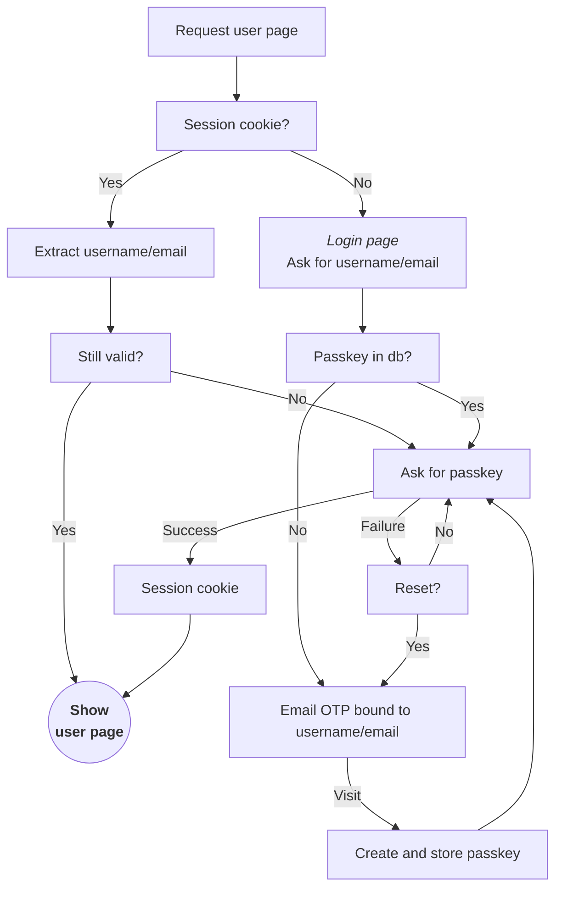

#

object storage

```
/
  sid
    {session_id} -> (user_id,identity_hash,timestamp)
    ...
  otp
    {otp_token} -> (user_id,identity_hash,timestamp)
    ...  
  pk
    {identity_hash}
      {user_id} -> {user}
        {passkey}
        {passkey}
    ...
```

### Sessions



Two cookies are used, one for the server and one for javascript:

- `st`
  contains the connection expiration timestamp (millis)

- `sid`
  *http-only (not accessible from javascript)*<br>
  contains the session id

Both cookies have the maximum lifespan because they don't include any sensitive information.

API requests return `403 FORBIDDEN` if the session id from the `sid` cookie is missing or expired.

For user scoped html pages, the server first checks if the `sid` cookie exists and refers to an
existing session id with user info (but it might be expired).<br>
If it doesn't, the server redirects to the login page.<br>
If it does, it updates the `st` cookie with the connection expiration timestamp.
That connection might already be expired.

The page (javascript) should look for the `st` cookie.<br>
If it's expired (or missing), the page should trigger the passkey authorization flow to reconnect
the user. Otherwise, api calls will fail because the connection has expired.

The passkey authorization flow is as follows:

- the page requests the challenge from the server
- the server retrieves the user info from the session id (from the `sid` cookie value).
  if this fails then the server returns an error, otherwise, it returns the challenge.
- ...

