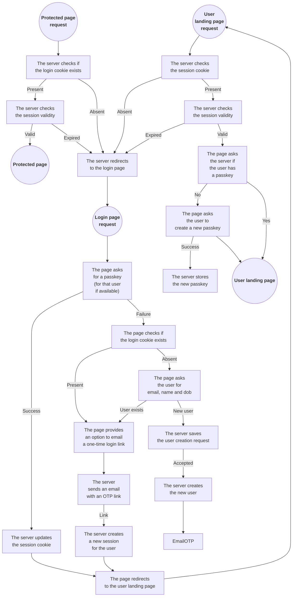

## Rust http server with static content and user protected content.

The server is set up so that it doesn't require disk access.

The static content comes from a GitHub repository.<br>
[zip_static_handler](https://crates.io/crates/zip_static_handler) is used for that purpose.<br>
The [project page](https://github.com/programingjd/zip_static_handler) details the conventions
for directory indices and redirects.<br>
Which repository is used is configurable with the environment variables:

- `STATIC_GITHUB_USER`
- `STATIC_GITHUB_REPOSITORY`
- `STATIC_GITHUB_BRANCH`

You can also set up a webhook to notify the server when the content has changed and needs
to be updated.<br>
You can do that with a GitHub push webhook (you can use any path, the server ignores it).<br>
You need to specify the token with the variable:

- `STATIC_GITHUB_WEBHOOK_TOKEN`

If you set that up, then updating the static content is simply done by pushing the updates to
the appropriate branch.<br>
Otherwise, you need to restart the server to have it pull up the new content.

<br>

The server is meant to be behind the Cloudflare CDN.<br>
You need to register the apex domain and its `www` subdomain with Cloudflare,
and specify the apex domain with the variable:

- `DOMAIN_APEX` (e.g. `example.com`)

There's a built-in firewall that terminates the connections unless they don't come from
one of the expected servers: a GitHub Webhook server for the update webhook request,
or a Cloudflare CDN server for all other requests.

The server is HTTPS only and the certificate is self-signed.

<br>

The user data is stored in an S3 bucket. You need to provide the information needed
to access it with those variables:

- `S3_REGION`
- `S3_ENDPOINT`
- `S3_BUCKET`
- `S3_ACCESS_KEY`
- `S3_SECRET_KEY`

That content is encrypted so that the information stays safe even if access to
the bucket is obtained. You should specify the encryption parameters with the variables:

- `STORE_ENCRYPTION_KEY` (32 bytes base64-encoded with no padding)
- `OTP_SIGNING_KEY` (32 bytes base64-encoded with no padding)
- `CHALLENGE_SIGNING_KEY` (32 bytes base64-encoded with no padding)

The bucket content is cached in memory and the server tries to update its cache every second.
If it takes longer to get the changes, the next update is delayed accordingly.

<br>

Parts of the static content should not be accessed unless the user is logged in.
You need to specify both the prefix for that content and the path to the login page
with the variables:

- `USER_PATH_PREFIX` (defaults to `/user` if not set)
- `LOGIN_PATH` (defaults to `/login` if not set)

You need to reserve a prefix for the API, and specify what it is with the variable:

- `API_PATH_PREFIX` (defaults to `/api` if not set)

Static content under that path will not be accessible.

<br>

The server needs to send messages to users to verify the ownership of their
email address and to send one-time login links.
You need to specify details about how the server should send those messages
with those variables:

- `EMAIL_API_ENDPOINT` (defaults to `https://smtp.maileroo.com/send`)
- `EMAIL_API_AUTH_HEADER`
- `EMAIL_API_AUTH_TOKEN`
- `EMAIL_API_METHOD` (defaults to `POST`)
- `EMAIL_API_REQUEST_CONTENT_TYPE` (defaults to `multipart/form-data`)
- `EMAIL_SEND_ADDRESS` (e.g. `noreply@example.com`)
- `EMAIL_ONE_TIME_LOGIN_TITLE` (the title to use for one-time login message)
- `EMAIL_ONE_TIME_LOGIN_TEMPLATE` (defaults to `email_otp.jinja`)

The template should be a `jinja` template
(see [the compatibility document](https://github.com/mitsuhiko/minijinja/blob/main/COMPATIBILITY.md))
under the `api` prefix as defined with the `API_PATH_PREFIX` variable.<br>
The variables available for the template are the user information:

- `link_url`
- `user.first_name`
- `user.last_name`
- `user.date_of_birth` (as a unix timestamp)
- `user.admin`

<br>

---

<br>

### S3 object storage bucket content

The path is not encrypted, but the content is.

<br>

session ids are under `/sid`:

```
/sid/{session_id} -> (user_id,timestamp)
```

one-time login tokens are under `/otp`:

```
/otp/{otp_token} -> (user_id,timestamp)
```

passkeys are user data are under `/pk`:

```
/pk/{user_id} -> {user}
/pk/{user_id}/{passkey_id} -> {passkey}
```

registrations pending approval are under `/reg`:

```
/reg/{user_id} -> {user}
```

<br>

---

<br>

### Restricted access to user-scoped pages



Two cookies are used, one for the server and one for javascript:

- `st` (accessible from javascript)<br>
  contains the connection expiration timestamp

- `sid`
  *http-only (not accessible from javascript)*<br>
  contains the session id

Both cookies have the maximum lifespan (400 days)
because they don't include any sensitive information.
A login session lifespan is much shorter (4 hours),
but we want to keep the cookies and the session ids on the server even after
the session has expired so that we can know who was logged in.

API requests return `403 FORBIDDEN` if the session id
from the `sid` cookie is missing or expired.

The page (javascript) should look for the `st` cookie.<br>
If its missing or its value indicates that the connection has expired or will expire soon
(it might need some time to make fetch requests that need the session to still be valid),
the page should redirect to the login page.

<br>

---

<br>

### User account

User data required for creating an account:

first name
last name
date of birth
identification (email)

Once all this information is gathered, the server generates a unique user id
and creates a new entry under `/pk` with the identity hash as the key and the user data for the value.
The identity hash is the salted hash of the identification method (email or phone number).

The server then creates a unique otp id. It is then stored in `/otp` with the id as the key,
and a value containing the user id, identity hash and a timestamp.
A link with the id and its signature is then sent to the identification method,
instructing the user to click on it to create credentials.

Once the server receives a request for that link, it checks the otp id signature,
and if the otp exists and its timestamp indicates that it hasn't expired.
If all that is true, it generates a new unique session id and stores it under `/sid`
with the session id as the key, and the user id, identity hash and a timestamp for the value.
The response also sets the two session cookies. The user is now logged in.

The server redirects to the user home page.

<br>

---

<br>

### Login page

The login page handles both login and new account requests.

The login page first asks for a passkey. If there's an expired session for a
specific user, then it asks for a passkey for that user only.

If it gets a passkey, then it updates the session cookie and redirects to the user
landing page.

If it couldn't get a passkey, and there's an expired session for a specific user,
then we ask that user if he wants a one-time login link.

If we don't know the user, then we ask for the

Just like all user-scoped pages, the login should trigger the passkey authorization flow
if the `st` cookie is missing or its value indicates that the connection expired.
Otherwise, it just redirects to the user home page.

If the passkey flow fails because there's no session id, then the user is prompted to enter
its identification method (email or phone number), first name, last name and date of birth.

Once the server receives this information, it checks if there's already a matching account.<br>
If there is then an otp is sent to the identification method (see the user account section
to see how the otp login is handled).<br>

If there is no matching account, then a new account needs to be created.

If the variable `VALIDATION_TOPT_SECRET` is set, then it means that registrations needs
to be approved unless a validation time-based one-time token is sent alongside the user
information. If set, the variable should be the base32-encoded secret for an
[ISO-6238 TOTP](https://datatracker.ietf.org/doc/html/rfc6238).

Cloudflare Turnstile is also supported if the variable `TURNSTILE_SECRET_KEY` is set.

If no validation is required (the variable is not set, or the validation token matches,
and if Turnstile is disabled or the validation succeeded), then the account is created.
See the user account section for more details.

If validation is required, a unique user id is created and stored under `/reg`
with the user id as the key and the user information as the value.<br>
There should be an admin page to validate or discard those requests.


