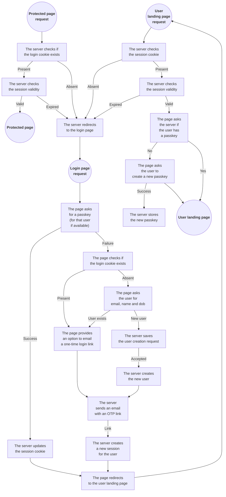

## Rust http server with static content and user protected content.

The server is set up so that it doesn't require disk access.

The static content comes from a GitHub repository.<br>
[zip_static_handler](https://crates.io/crates/zip_static_handler) is used for that purpose.<br>
The [project page](https://github.com/programingjd/zip_static_handler) details the conventions
for directory indices and redirects.<br>
Which repository is used is configurable with the environment variables:

- `STATIC_GITHUB_USER`
- `STATIC_GITHUB_REPOSITORY`
- `STATIC_GITHUB_BRANCH`

You can also set up a webhook to notify the server when the content has changed and needs
to be updated.<br>
You can do that with a GitHub push webhook (you can use any path, the server ignores it).<br>
You need to specify the token with the variable:

- `STATIC_GITHUB_WEBHOOK_TOKEN`

If the request comes from a github server, then the server assumes that it is a webhook,
and the endpoint doesn't matter. If the webhook endpoint is proxied via cloudflare, then
the endpoint should be `/github_push_webhook`.

If you set that up, then updating the static content is simply done by pushing the updates to
the appropriate branch.<br>
Otherwise, you can also call `https://localhost/github_push_webhook` from the server
and of course you can simply restart the server to have it pull up the new content.

<br>

The server is meant to be behind the Cloudflare CDN.<br>
You need to register the apex domain and its `www` subdomain with Cloudflare,
and specify the apex domain with the variable:

- `DOMAIN_APEX` (e.g. `example.com`)

There's a built-in firewall that terminates the connections unless they don't come from
one of the expected servers: a GitHub Webhook server for the update webhook request,
or a Cloudflare CDN server for all other requests.

The server is HTTPS only and the certificate is self-signed.

<br>

The user data is stored in an S3 bucket. You need to provide the information needed
to access it with those variables:

- `S3_REGION`
- `S3_ENDPOINT`
- `S3_BUCKET`
- `S3_ACCESS_KEY`
- `S3_SECRET_KEY`

That content is encrypted so that the information stays safe even if access to
the bucket is obtained. You should specify the encryption parameters with the variables:

- `STORE_ENCRYPTION_KEY` (32 bytes base64-encoded with no padding)
- `OTP_SIGNING_KEY` (32 bytes base64-encoded with no padding)
- `CHALLENGE_SIGNING_KEY` (32 bytes base64-encoded with no padding)

The bucket content is cached in memory and the server tries to update its cache every second.
If it takes longer to get the changes, the next update is delayed accordingly.

<br>

Parts of the static content should not be accessed unless the user is logged in.
You need to specify both the prefix for that content and the path to the login page
with the variables:

- `USER_PATH_PREFIX` (defaults to `/user` if not set)
- `LOGIN_PATH` (defaults to `/login` if not set)

You need to reserve a prefix for the API, and specify what it is with the variable:

- `API_PATH_PREFIX` (defaults to `/api` if not set)

Static content under that path will not be accessible.

<br>

The server needs to send messages to users to verify the ownership of their
email address and to send one-time login links.
You need to specify details about how the server should send those messages
with those variables:

- `EMAIL_API_ENDPOINT` (defaults to `https://smtp.maileroo.com/send`)
- `EMAIL_API_AUTH_HEADER`
- `EMAIL_API_AUTH_TOKEN`
- `EMAIL_API_METHOD` (defaults to `POST`)
- `EMAIL_API_REQUEST_CONTENT_TYPE` (defaults to `multipart/form-data`)
- `EMAIL_SEND_ADDRESS` (e.g. `noreply@example.com`)
- `EMAIL_ONE_TIME_LOGIN_TITLE` (the title to use for one-time login message)
- `EMAIL_ONE_TIME_LOGIN_TEMPLATE` (defaults to `email_otp.jinja`)

The template should be a `jinja` template
(see [the compatibility document](https://github.com/mitsuhiko/minijinja/blob/main/COMPATIBILITY.md))
under the `api` prefix as defined with the `API_PATH_PREFIX` variable.<br>
The variables available for the template are the user information:

- `link_url`
- `user.first_name`
- `user.last_name`
- `user.date_of_birth` (as a unix timestamp)
- `user.admin`

<br>

---

<br>

### S3 object storage bucket content

The path is not encrypted, but the content is.

<br>

session ids are under `sid`:

```
sid/{session_id} -> (user_id,timestamp)
```

one-time login tokens are under `otp`:

```
otp/{otp_token} -> (user_id,timestamp)
```

user data is under `acc`:

```
acc/{user_id} -> {user}
```

passkeys and under `pk`:

```
pk/{user_id}/{passkey_id} -> {passkey}
```

registrations pending approval are under `reg`:

```
reg/{user_id} -> {user}
```

<!--
security related counters are under `sec`:

```
sec/{user_id}/otp -> {rate limiting counters}
sec/{user_id}/auth -> {rate limiting counters}
```
-->
<br>

---

<br>

### Restricted access to user-scoped pages



Two cookies are used, one for the server and one for javascript:

- `st` (accessible from javascript)<br>
  contains the connection expiration timestamp

- `sid`
  *http-only (not accessible from javascript)*<br>
  contains the session id

Both cookies have the maximum lifespan (400 days)
because they don't include any sensitive information.
A login session lifespan is much shorter (4 hours),
but we want to keep the cookies and the session ids on the server even after
the session has expired so that we can know who was logged in.

API requests return `403 FORBIDDEN` if the session id
from the `sid` cookie is missing or expired.

The page (javascript) should look for the `st` cookie.<br>
If its missing or its value indicates that the connection has expired or will expire soon
(it might need some time to make fetch requests that need the session to still be valid),
the page should redirect to the login page.

<br>

---

<br>

### Login page

The login page handles both login and new account requests.

The login page first asks for a passkey. <!--If there's an expired session for a
specific user, then it asks for a passkey for that user only.-->

If it gets a passkey, then it updates the session and cookies and
redirects to the user landing page.

If it couldn't get a passkey, and there's an expired session for a specific user,
then it provides an option to send a one-time login link to the user's email address.

If the user is not known, then the page asks for the user information:

- email
- last name
- first name
- date of birth

If that user already has an account, then the login page provides an option
to send a one-time login link to the user's email address.

If the variable `VALIDATION_TOPT_SECRET` is set, then it means that new accounts need
to be approved unless a validation time-based one-time token is sent alongside the user
information. If set, the variable should be the base32-encoded secret for an
[ISO-6238 TOTP](https://datatracker.ietf.org/doc/html/rfc6238).

If it's set then the login page asks the user for that token (it's not required).

If that token is provided, but invalid, the user is asked again.<br>
If it's valid, then the user account is created right away and the server sends
a one-time login link to the user's email address.<br>
If it's not provided then the user request is saved instead and the request will
need to be moderated by an admin.

Cloudflare Turnstile is supported if the variable `TURNSTILE_SECRET_KEY` is set.

<br>

---

### API Endpoints

The endpoints are under the api prefix.

- `HEAD` `{api}/auth/credentials`<br>
  Login session existence check<br>
  Returns a `204 No Content` if the user is known and has at least one passkey (the session might be expired though),
  or a `404 Not Found` otherwise.

- `POST` `{api}/auth/credential_request_options`<br>
  Passkey challenge request.<br>
  See [MDN documentation](https://developer.mozilla.org/en-US/docs/Web/API/PublicKeyCredentialRequestOptions).<br>
  The body should be a JSON object with a `uuid` (from `crypto.randomUUID()`) and can include `metadata`.

- `POST` `{api}/auth/credential_creation_options`<br>
  Passkey challenge for creating new credentials for the current user.<br>
  See [MDN documentation](https://developer.mozilla.org/en-US/docs/Web/API/PublicKeyCredentialCreationOptions).<br>
  The body should be a JSON object with a `uuid` (from `crypto.randomUUID()`) and can include `metadata`.

- `POST` `{api}/auth/record_credential`<br>
  Checks and records a new passkey for the current user.

- `POST` `{api}/auth/validate_credential`<br>
  Checks the passkey and creates a user session if valid.

- `GET` `{api}/auth/forget_user`<br>
  Deletes the session and the associated cookies.

- `GET` `{api}/auth/disconnect_user`<br>
  Invalidates the session and update the `st` cookie.

- `GET` `{api}/otp/{token}`<br>
  One-time login link<br>
  Validates the link, creates a new session for the user and redirects to the user landing page.

- `POST` `{api}/otp`<br>
  Requests a new email with a one-time login link.

- `GET` `{api}/user`<br>
  Gets the logged-in user info.

- `GET` `{api}/user/passkeys`<br>
  Gets the list of passkeys for the current logged-in user.

- `DELETE` `{api}/user/passkeys/{id}`<br>
  Invalidates the specified passkey of the current logged-in user.

- `POST` `{api}/user`<br>
  Submits a new account request.

- `POST` `{api}/user/email`<br>
  Submits an account email update request.

- `GET` `{api}/user/admin/users`<br>
  Lists all registered users.

- `GET` `{api}/user/admin/registrations`<br>
  Lists all the pending user registrations.

- `POST` `{api}/user/admin/registrations`<br>
  Accepts a user registration.
